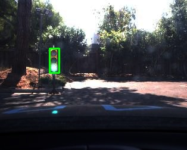

This is the project repo for the final project of the Udacity Self-Driving Car Nanodegree: Programming a Real Self-Driving Car. For more information about the project, see the project introduction [here](https://classroom.udacity.com/nanodegrees/nd013/parts/6047fe34-d93c-4f50-8336-b70ef10cb4b2/modules/e1a23b06-329a-4684-a717-ad476f0d8dff/lessons/462c933d-9f24-42d3-8bdc-a08a5fc866e4/concepts/5ab4b122-83e6-436d-850f-9f4d26627fd9).


### Implementation details

#### Software architecture

The following is a system architecture diagram showing the ROS nodes and topics used in the project.


#### Traffic lights detection

For detecting traffic lights from a camera feed a pre-trained on the [COCO dataset](http://mscoco.org/) model [ssdlite_mobilenet_v2_coco](http://download.tensorflow.org/models/object_detection/ssdlite_mobilenet_v2_coco_2018_05_09.tar.gz) has been taken from the [Tensorflow detection model zoo](https://github.com/tensorflow/models/blob/master/research/object_detection/g3doc/detection_model_zoo.md). The model was selected based on the processing speed as being the fastest among the latest listed. Although the frozen inference graphs were generated using the [v1.8.0](https://github.com/tensorflow/tensorflow/tree/v1.8.0) release version of Tensorflow and the project required version [v1.3.0](https://github.com/tensorflow/tensorflow/tree/v1.8.0), the model appeared to be compatible with that version.



#### Traffic light color identification

Once the model finds the traffic lights and provides you the boundary boxes, the next step is to crop the traffic light images from the scene based on those boxes and identify the color. The approach is entirely based on image processing:
1. Convert the image into LAB color space and isolate the L channel. Good support material can be found [here](https://www.learnopencv.com/color-spaces-in-opencv-cpp-python/).


2. Split the traffic light cropped image onto three equal segments - upper, middle, and lower corresponding to read, yellow, and green lights respectively. 


3. To identify the color, we need to find out which segment is brighter. Thanks to the LAB color space, L channel gives us exactly that information. All we need to do is to find the sum of all pixels in each of the three segments. The highest score gives us the traffic light color. 

`The light is GREEN`

In the real scenario several filtering methods are applied to give a more reliable estimate. 
1. Among all the lights detected in a frame, the one with the highest confidence score is selected.
2. The respected lights' boundary box is verified based on the aspect ratio. If it doesn't fit into our threshold, that means the image will not be correctly cropped and the color may be wrongly identified.
3. Gamma correction was used to enhance too bright images at every second frame.

### Native Installation

* Be sure that your workstation is running Ubuntu 16.04 Xenial Xerus or Ubuntu 14.04 Trusty Tahir. [Ubuntu downloads can be found here](https://www.ubuntu.com/download/desktop).
* If using a Virtual Machine to install Ubuntu, use the following configuration as minimum:
  * 2 CPU
  * 2 GB system memory
  * 25 GB of free hard drive space

  The Udacity provided virtual machine has ROS and Dataspeed DBW already installed, so you can skip the next two steps if you are using this.

* Follow these instructions to install ROS
  * [ROS Kinetic](http://wiki.ros.org/kinetic/Installation/Ubuntu) if you have Ubuntu 16.04.
  * [ROS Indigo](http://wiki.ros.org/indigo/Installation/Ubuntu) if you have Ubuntu 14.04.
* [Dataspeed DBW](https://bitbucket.org/DataspeedInc/dbw_mkz_ros)
  * Use this option to install the SDK on a workstation that already has ROS installed: [One Line SDK Install (binary)](https://bitbucket.org/DataspeedInc/dbw_mkz_ros/src/81e63fcc335d7b64139d7482017d6a97b405e250/ROS_SETUP.md?fileviewer=file-view-default)
* Download the [Udacity Simulator](https://github.com/udacity/CarND-Capstone/releases).

### Docker Installation
[Install Docker](https://docs.docker.com/engine/installation/)

Build the docker container
```bash
docker build . -t capstone
```

Run the docker file
```bash
docker run -p 4567:4567 -v $PWD:/capstone -v /tmp/log:/root/.ros/ --rm -it capstone
```

### Port Forwarding
To set up port forwarding, please refer to the [instructions from term 2](https://classroom.udacity.com/nanodegrees/nd013/parts/40f38239-66b6-46ec-ae68-03afd8a601c8/modules/0949fca6-b379-42af-a919-ee50aa304e6a/lessons/f758c44c-5e40-4e01-93b5-1a82aa4e044f/concepts/16cf4a78-4fc7-49e1-8621-3450ca938b77)

### Usage

1. Clone the project repository
```bash
git clone https://github.com/udacity/CarND-Capstone.git
```

2. Install python dependencies
```bash
cd CarND-Capstone
pip install -r requirements.txt
```
3. Make and run styx
```bash
cd ros
catkin_make
source devel/setup.sh
roslaunch launch/styx.launch
```
4. Run the simulator

### Real world testing
1. Download [training bag](https://s3-us-west-1.amazonaws.com/udacity-selfdrivingcar/traffic_light_bag_file.zip) that was recorded on the Udacity self-driving car.
2. Unzip the file
```bash
unzip traffic_light_bag_file.zip
```
3. Play the bag file
```bash
rosbag play -l traffic_light_bag_file/traffic_light_training.bag
```
4. Launch your project in site mode
```bash
cd CarND-Capstone/ros
roslaunch launch/site.launch
```
5. Confirm that traffic light detection works on real life images


